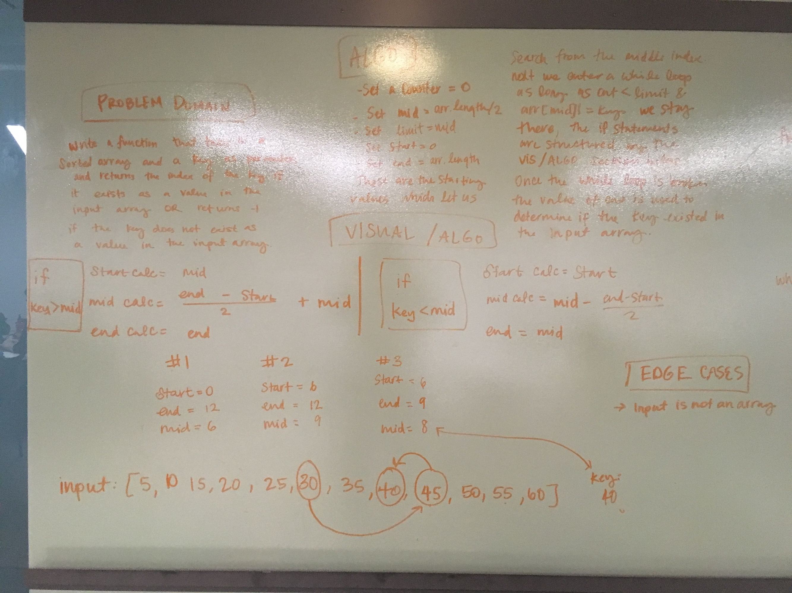
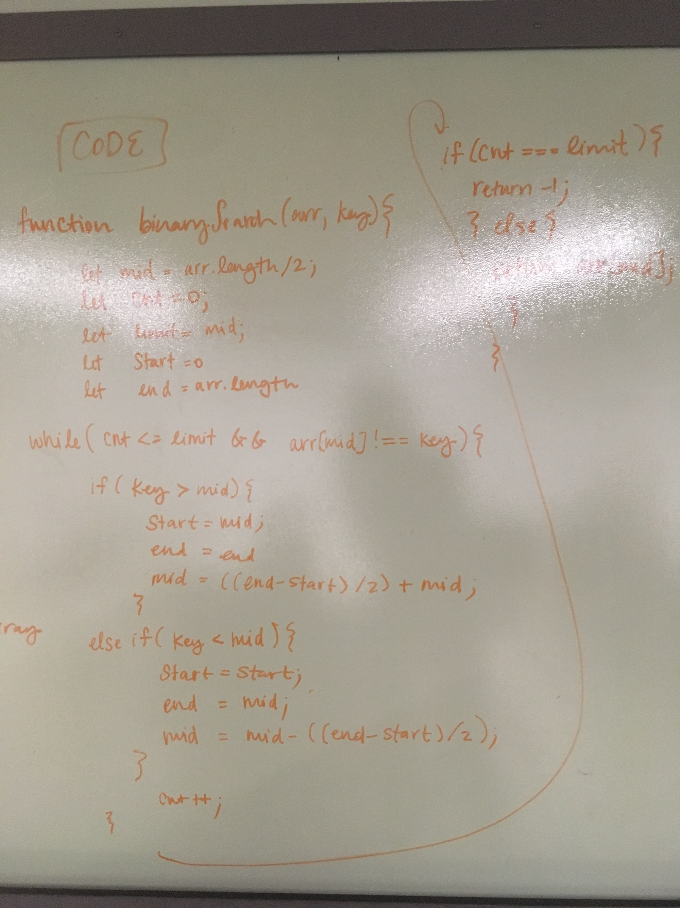

# Binary Search
#### Author: Caity Heath and Jared Pattison

## Challenge
My BinarySearch function takes in 2 parameters: a sorted array and the search key. Without utilizing any of the built-in methods available to JavaScript, return the index of the array’s element that is equal to the search key, or -1 if the element does not exist.

## Approach & Efficiency
Our approach to this probem was to not use a for loop to maximize efficiency. 
* mid = arr.length/2
* limit = mid;
* cnt = 0;
* start = 0; 
* end = 0;

Above are the starting values which help us search from the middle index. Next we ender a while loop. As loong as cnt < limit AND arr[mid] = key the while loop will continue to execute. The if statements within the while loop are structured by the algorithms pictured below in the solution section. Once the while loop is broken the value of cnt is used to determine if the key existed in the input array by checking cnt against limit. This is because with my algorithm the search count should never exceed more than the array length divided by 2. If cnt < limit then the returned value will be the value at arr[mid]. 

## Solution

