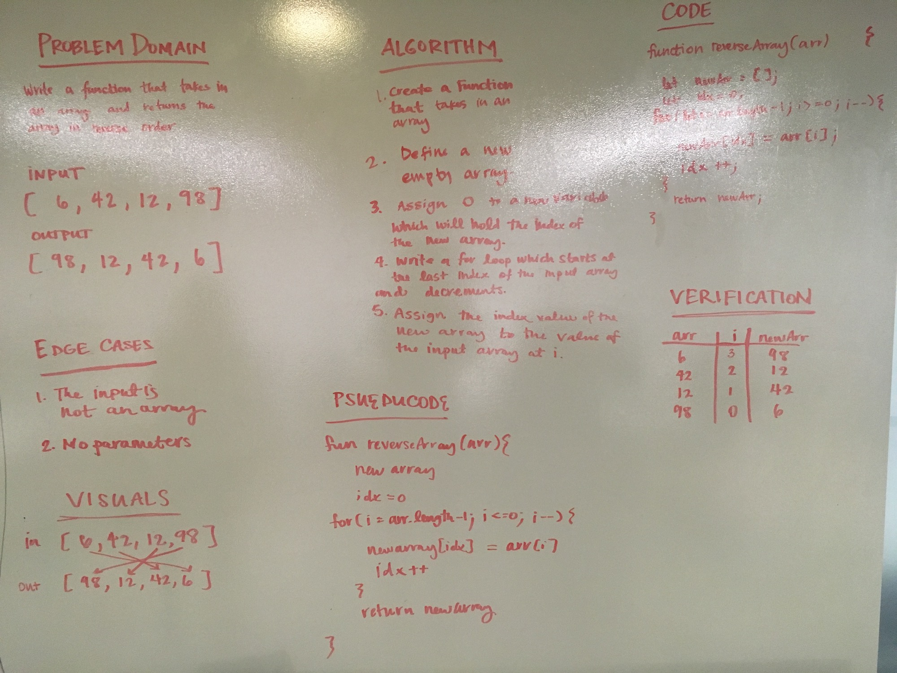
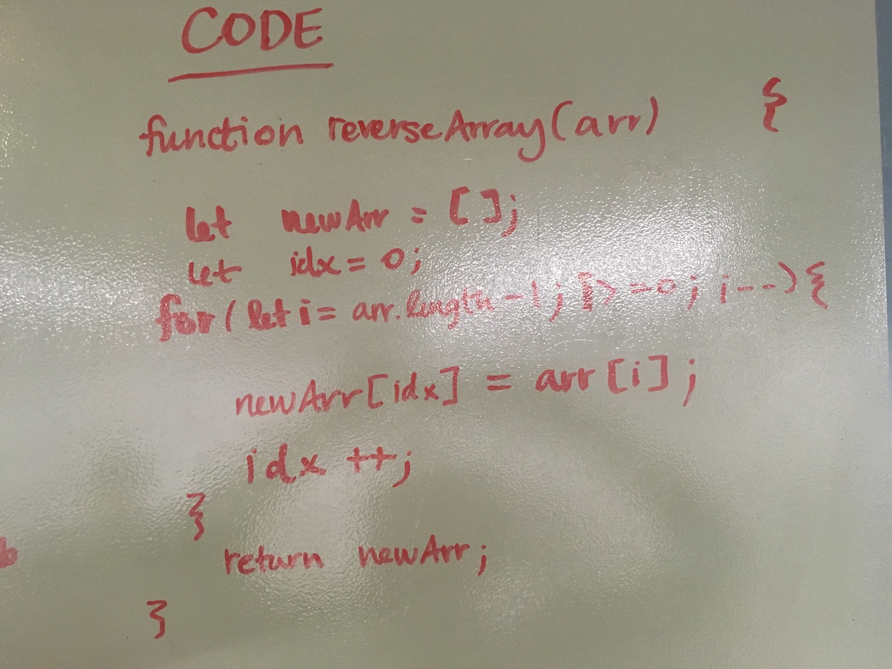

# Reverse an Array

## Challenge
The problem domain of this challenge was to take an array as an input and return a new array in reverse order. 

## Approach & Efficiency
My solution takes an input array and returns a new array reversed. My process of accomplishing that begins with the declaration of an empty array and the assignment of an idx variable to 0. This variable is going to represent the index of the output array that will be filled with the values of the input array. A for loop will iterate through the input array starting at the last index and decrementing to the first, at each iteration the new array at the index of the idx variable will be assigned the value of the input array at i. Each iteration will also increment the idx value by 1. Once the for loop break the new array will be returned. 

## Solution

Upclose of code solution

