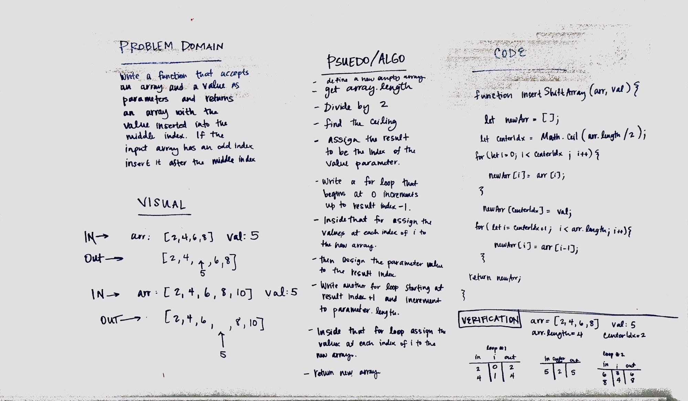

# Insert and shift middle index of array
This is Code Challenge 2 for JavaScript 401

## Challenge
insertArrayShift function accepts an array and a value as parameters and returns an new array with the value inserted into the middle index. If the input array has an odd index it is inserted after the middle index. 

## Approach 
We decided to take the functional programming approach and write a pure function which does not mutate the parameters, instead our function returns a new array.  
<ul>
<li> We started by defining an empty array and assigning a variable centerIdx to ceiling of the input array's length divided by two.
<li>Then we wrote a for loop which starts at 0 and ends at the centerIdx-1. We assigned the value of the new array at i to the value of the input array at i. Meaning values in each array up until the center index are identical. 
<li> Once that for loop breaks we assign the value of the new array at centerIdx to the input value. 
<li>Then we wrote another for loop which starts at centerIdx + 1 and increments to arr.length. Inside the for loop we assign the value of newArray at i to the value of input arr at i -1. This for loop fills the new array with all of the remaining values from the input array.
<li>Return the new array.
 </ul>

## Solution

##Authors
Lena Eivy and Caity Heath