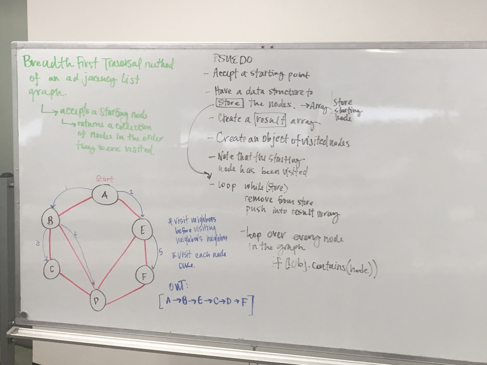
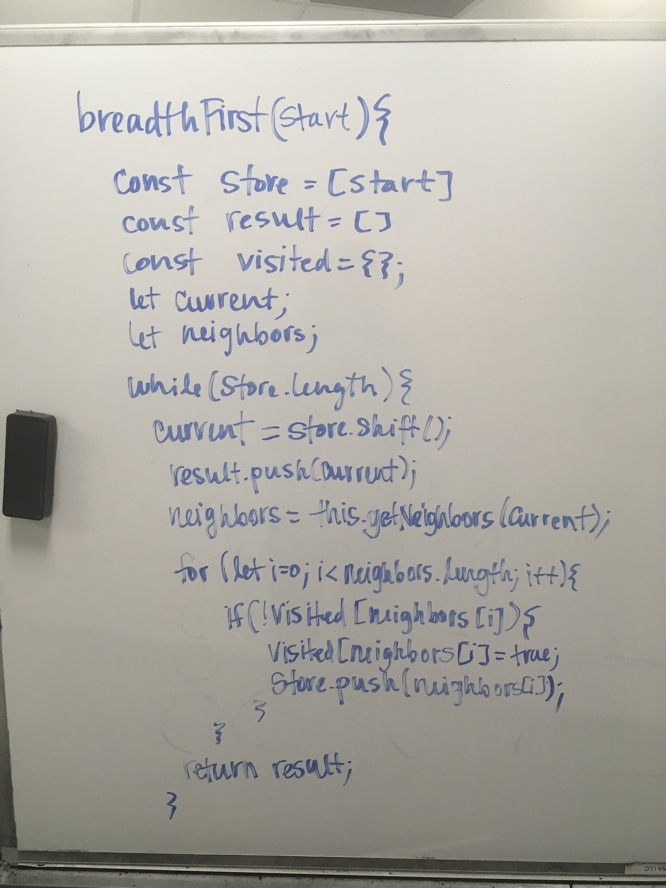
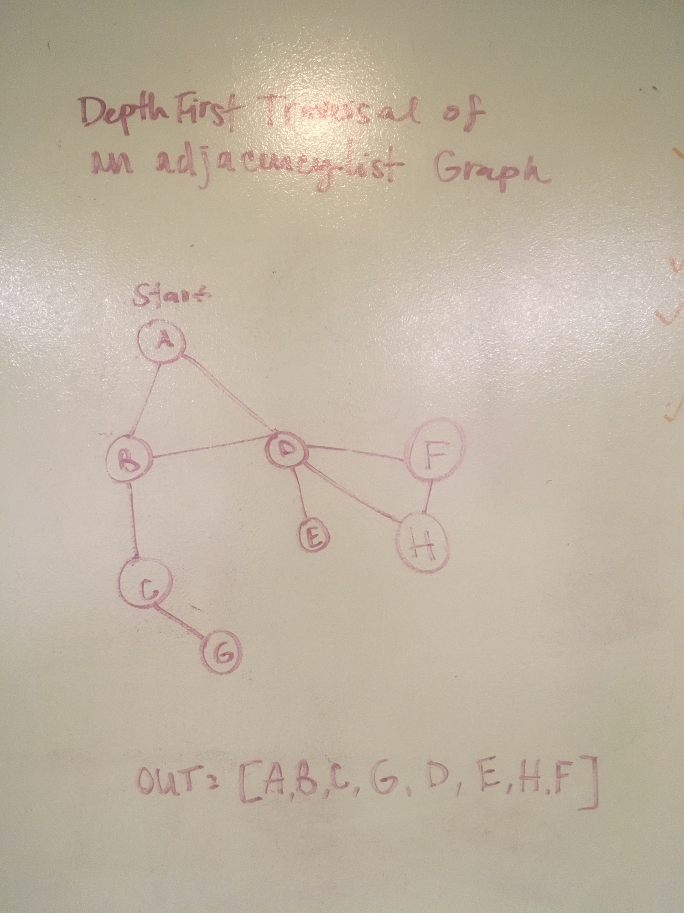
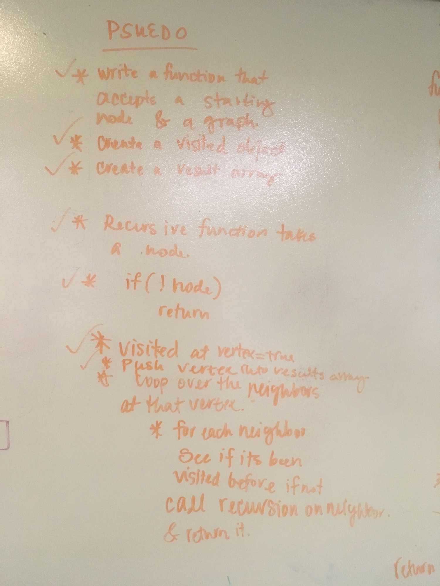
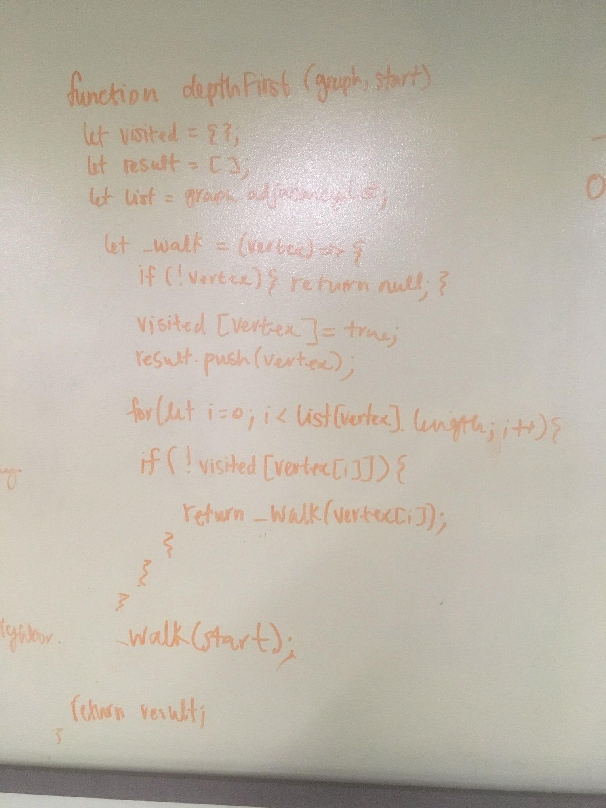
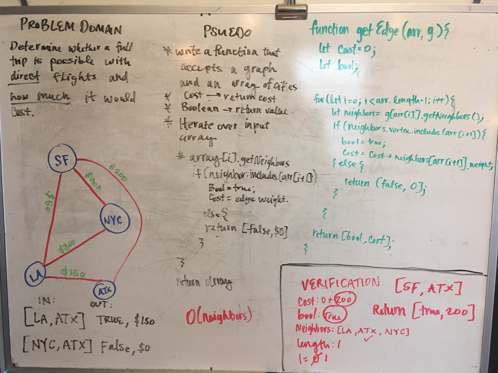

# Adjacency List Graph

### Author: Caity Heath

A graph data-structure consists of a finite set of vertices and connections between them. 

## Approach & Efficiency
My adjacency list graph is comprised of an object containing keys and value pairs. The value at each key is an array which serves as a list of the node's neighbors. 

### Big O of an Adjacency List
* Adding a vertex -> O(1)
* Adding an edge -> O(1)
* Query -> O(1)
* Storage -> O( |vertices| + |edges| )
* Breadth First Search -> O( |vertices| + |edges| )
* Depth First Search -> O( |vertices| + |edges| )

## API

* `addNode(key)`
  * Accepts a vertex as a parameter adds it to a graph. 
* `addEdge(node1, node2, weight)`
  * Accepts two vertices and a weight as parameters. This method connects the two vertices and gives assigns the edge the given weight. 
* `getNodes()`
  * Returns all of the nodes in an array
* `getNeighbors(node)`
  * Accepts a vertex as a parameter and returns each neighbor and the edge weight. 
* `size()`
  * Returns the size of the graph.
* `breadthFirst(start)`
  * Returns a set of nodes in the order the graph was traversed. 

---

### Solution for Breadth First Traversal

#### Algorithm 
* Accepts a starting point
* Define a queue to que and enque nodes as you traverse the graph.
* Define a results array
* Define an Object which will hold the node values as you visit them.
* Define the current node. 
* Define neighbors which will hold the array of neighbors. 
* Write a while loop while the store has length. 
  * current is set to the value dequed from the queue. 
  * push current into the result array
  * get the neighbors of current and set the list of them to the variable neighbors. 
    * Iterate through neighbors. 
    * if the neighbor doesn't exists in the visited object
      * That node is added to the visited object and assigned a value of true.
      * Push the neighbor into the store. 

* Return result

#### Efficiency 
O(|Edges| + |Vertices|)

---
### Solution for Breadth First Traversal

#### Algorithm 
* Accepts a graph and a starting point
* Declare an empty object -> store the visted nodes
* Declare an empty array -> store the nodes in pre-order visitation
* Create a recursive function which takes a node as a parameter. 

* Write a base case
    * if there isn't a node return null

* Add the node to the visited object and set its value to true.
* Push the node into the results array.
* Iterate over the neighbors of the node
    * at each neighbor check if it is stored in the visited object.
    * If it isn't return _walk(neighbor) -> this will run the recursive function on each of the neighbors that haven't been visited. 

* Invoke the walk function with the start node
* Return result

#### Efficiency 
O( |Edges| + |Vertices| )

---

## Code Challenges

#### Get Edge

Determine whether a full trip is possible with direct flights and how much it would cost. 

##### Algorithm
* Write a function that accepts a graph and an array of cities
* Define a cost variable -> `let cost = 0`
* Define a boolean variable -> `let bool = 0`
* Iterate over the array of cities starting at 0 and ending at city.length - 1, as you don't have to loook at the last city.
  * Find the neigbors 
  * Iterate over the neighbors and see if any of them are the same as the next index in the city array. 
    * if its true -> `bool = true, cost = cost + edge weight. `
    * if its false -> return `[false, 0]`

* return `[bool, cost]`

##### Efficiency
O(n^2);

##### Solution

