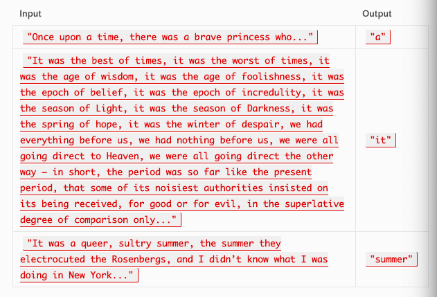

# First repeated word

### Author: Caity Heath

## Challenge
Write a method that accepts a lengthy string parameter and returns the first word to occur more than once in that provide string. 

---

## Approach
* Write a function that accepts a string as a parameter.
* Declare a HashTable which will privide access to the methods get, contains and add.
* Normalize the input string
* Remove punctuation.
* Split the string into an array. 
* Iterate of the array.
  * If the hash contains the key => return the key
  * If the hash does not contain the key => add the key to the hash.
* Return "No Repeats" if the loop breaks without returning, meaning that no repeats were found.

---

## Efficiency
1 for loop => time: O(n)
1 hashmap => space: O(size)

---

## Solution

