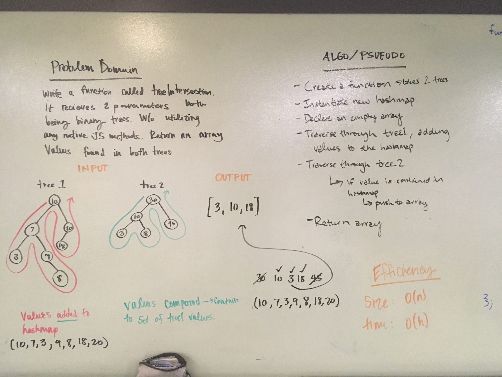
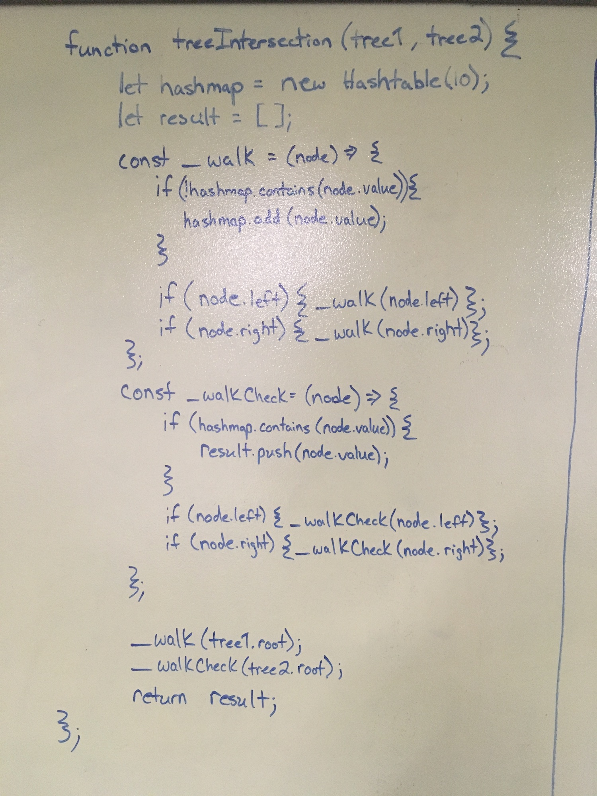

# Intersection of binary trees
## Authors :
Caity Heath, Becca Lee, Brent Woodard
 

## Challenge
This function recieves two parameters both of which must be binary trees and returns an array containing the values that exist in both binary trees. 

## Approach & Efficiency
Our approach to this problem utilizes 3 data-structures: array, hash map and binary trees. The first step of our algorithn is two simple declarations. One of a hashmap and one of an array. The first tree will be traversed with a depth-first traversal. If the values don't already exist in the hash map then they are added. After the traversal of the first tree is complete, a traversal of the second tree will run. If the value is contained in the hashmap then the value will be pushed into the array. After the second tree traversal the array is returned. 

## Solution

