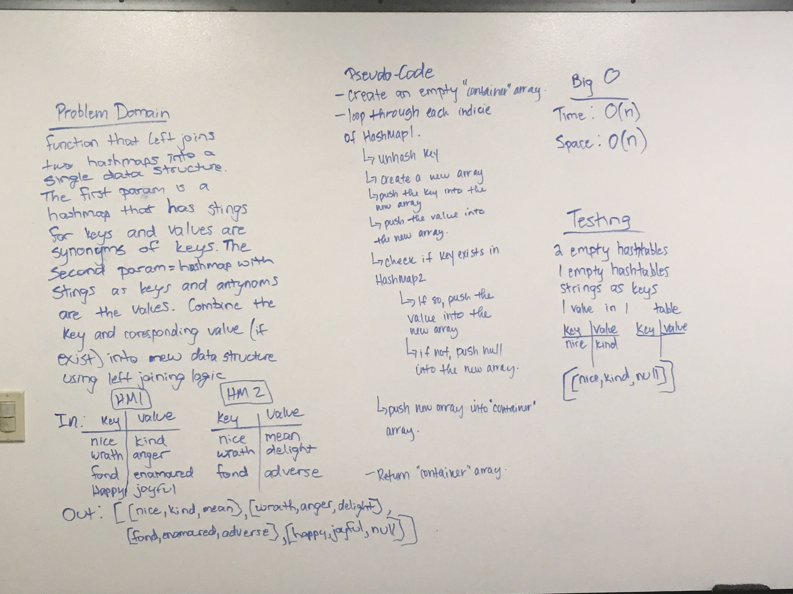
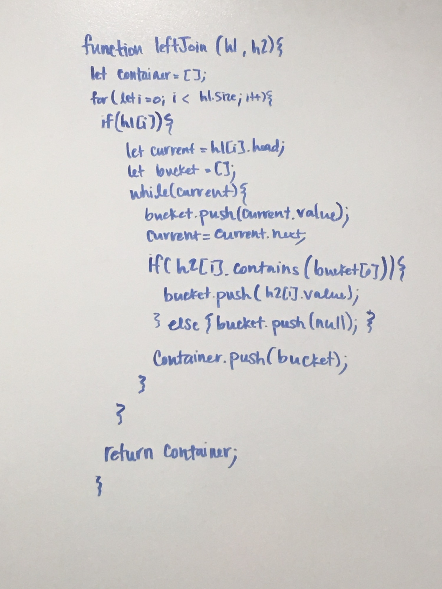

# Hashmap LEFT JOIN
#### Authors: Caity Heath, Lena Eivy & Heather Cherewaty
---

## Challenge
Write a function that LEFT JOINs two hashmaps into a single data structure. Both hash maps will contain key:value pairs of type string. Combine the keys and corresponding values (if they exist) into a new data structure according to LEFT JOIN logic. 

* LEFT JOIN means all the values in the first hashmap are returned, and if values exist in the “right” hashmap, they are appended to the result row. If no values exist in the right hashmap, then some flavor of NULL should be appended to the result row.

The returned data structure can be of any type. 
Aviod utilizing any of the library methods available to your language. 

#### Example

---

## Approach & Efficiency
O(n) due to the for loop which we use to iterate of hash1. 

* Our algorithm begins by declaring an empty array which will be returning later.
* Iterate over the first argument: hash1
* At the indices that have a value, traverse the bucket which in our case is a linked list. 
* declare an array which will serve as a bucket to the items in the hashtable bucket, each key will have its own bucket array. 
* if hash2 contains the contains a shared key, the value of that key will be pushed into the bucket array. If it doesn't contain a shared key then null will be pushed into the bucket array. 
* Push the bucket array into the container before the while loop breaks. 
*  When the for loop breaks, return the container.

---

## Solution

