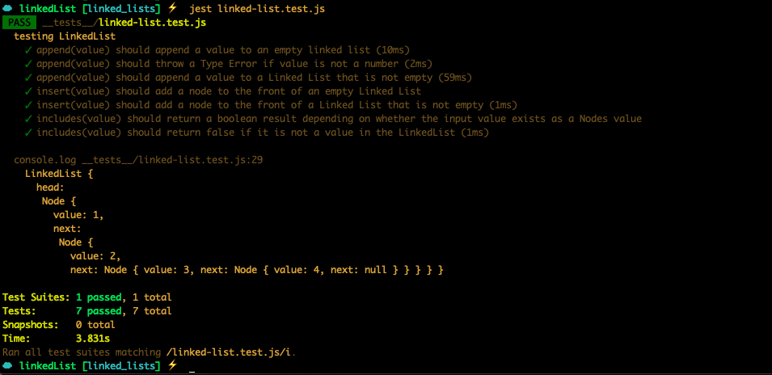
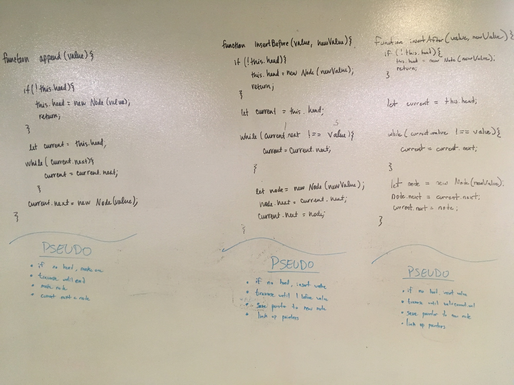
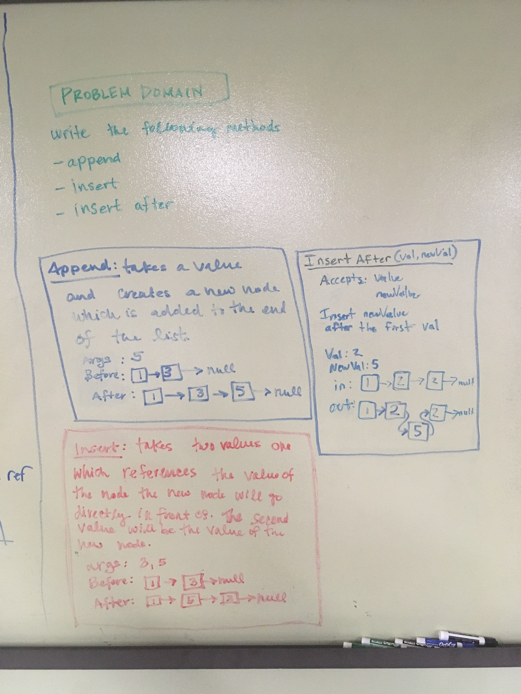
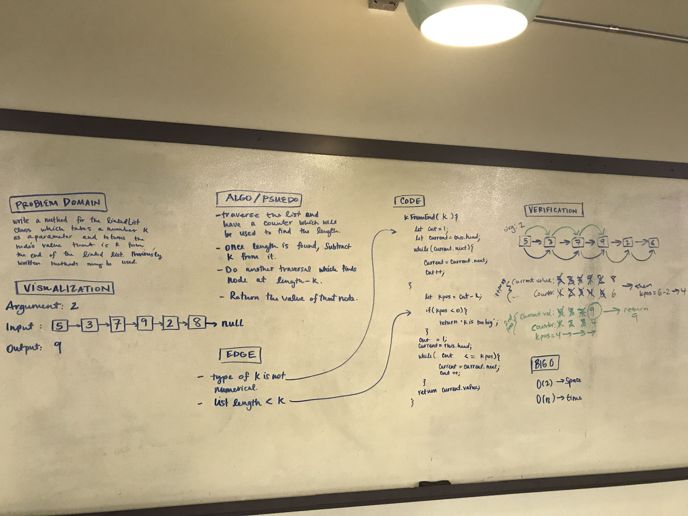

# Singly Linked List 

A singly linked list is a linear data structure made up of nodes that that points to the next node in the list. 

## Challenge

This application has 6 functions which perform the following operations on the linked list class. 
*   append: adds a value to the end of the list
*   insertBefore: takes 2 arguments the first references the value of the node that the new node will be inserted directly before. The second is the value of the new node. 
*   insertAfter: takes 2 arguments the first references the value of the node that the new node will be inserted directly after. The second is the value of the new node. 
*   insert: adds a value tot the front of the list
*   includes: traverses the linked-list to find the input value and returns a boolean value depending on if the the value exists in the list. 
*   kFromEnd: takes a number and returns the node's value that is k from the end of the linked list. 

## Approach & Efficiency

The efficiency of a linked list is from a storage standpoint is O(1) and from a time stand point it is O(n). 

## Setup 
In order to run the tests on my application, you will need to `npm i jest lint`.  To test you will run the command `jest linked-list.test.js` you should see the following output:

## Solution

append, insertBefore and insertAfter

kFromEnd

