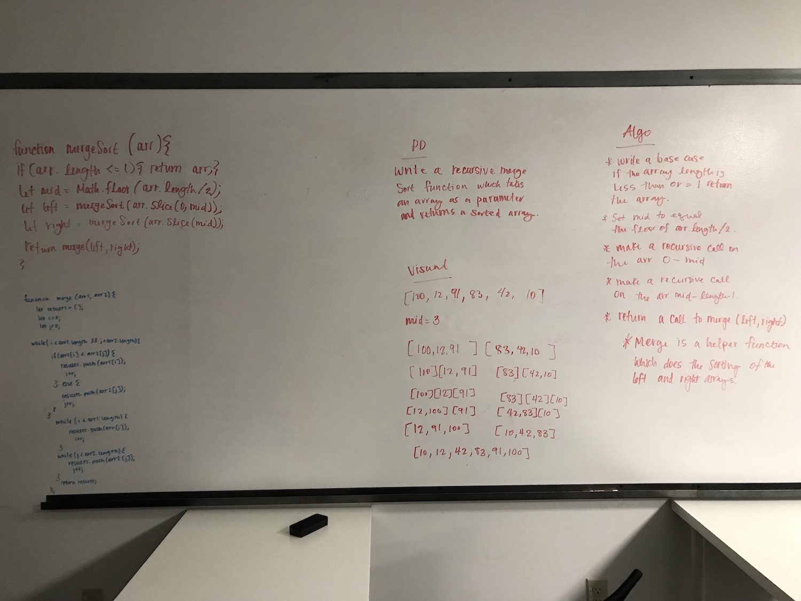
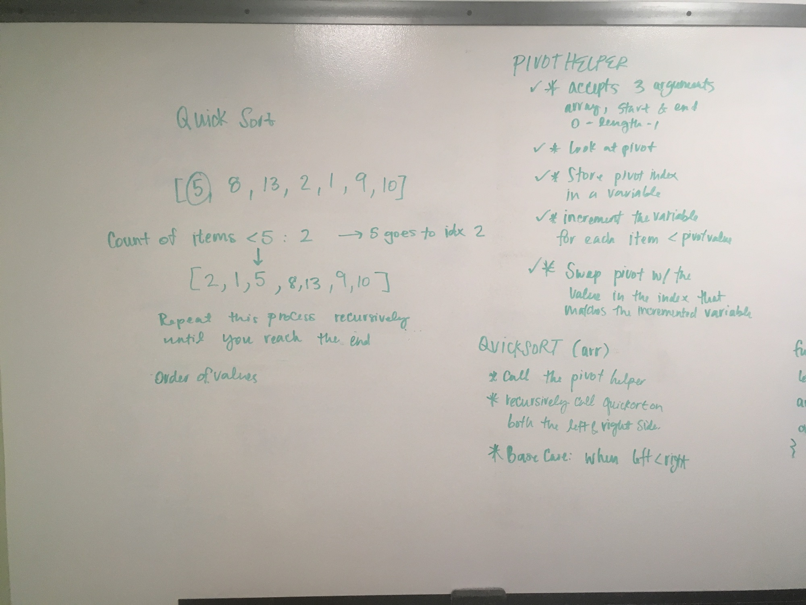
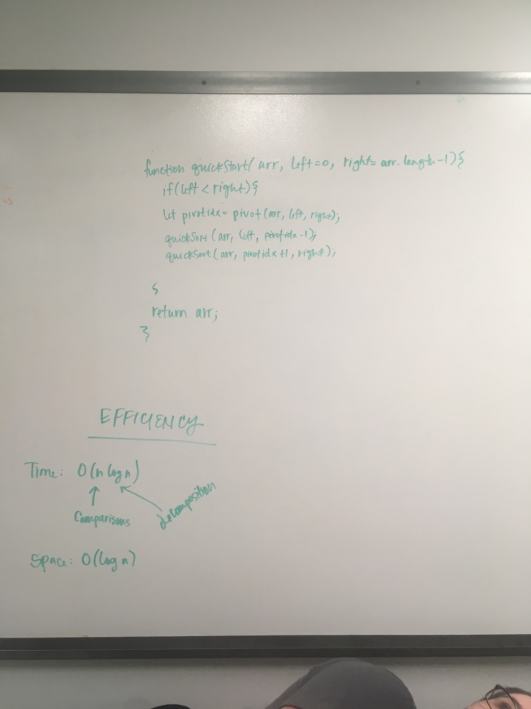
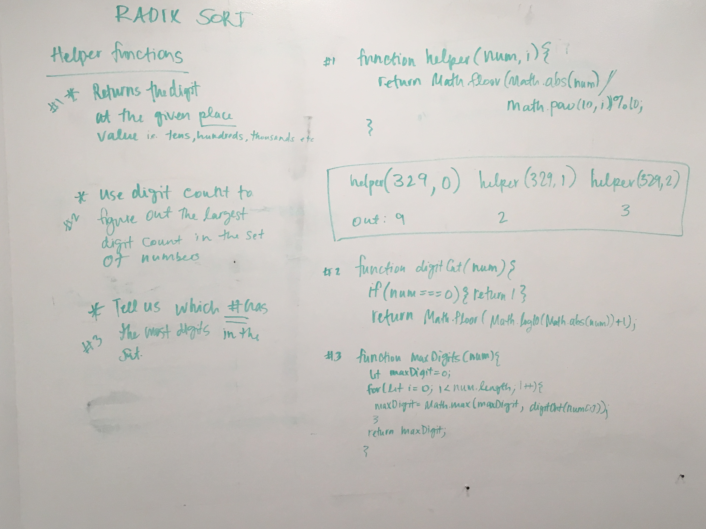
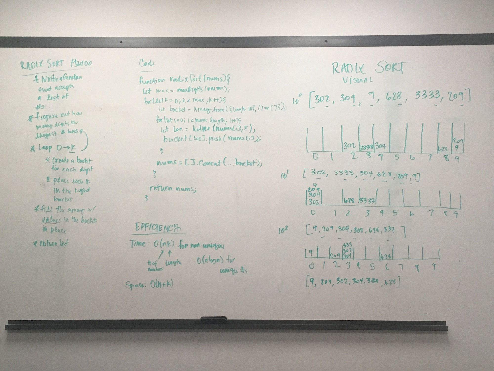

# Sorts
## Author Caity Heath

Solutions for the following sorts can be found in this directory. Keep reading to learn more about my algorithms. 
* Merge Sort
* Quick Sort
* Radix Sort

---

## Merge Sort

### Algorithm 
* Write a base case, If the array length is less than or equal to 1 then return the array. 
* Define a mid variable and assign it the floored value of the array length / 2. 
* Make a recursive call on the the array on values in indices 0 - mid.
* Make a recursive call on the array mid - length-1

### Efficiency
##### Time: O(n log n)
 The decompositions lend to the log n and the comparisons lend to the n. 

##### Space: O(log n) 

### Whiteboard Solution

---

## Quick Sort

### Algorithm 
Helper Function:
* accepts 3 arugments: array, start point and end point.
* Store the start point in the a variable
* increment the variable for each time an item in the set is less than the value of the start point. 
* Swap the start point with the value in the index that matches the incremented variable. 

Quick Sort Function:
* Call the pivot helper
* Recursively call the quicksort on both the left and right side using the base case of when left < right. 

### Efficiency

##### Time O(n log n)
 The decompositions lend to the log n and the comparisons lend to the n. 

##### Space O(log n)

### Whiteboard Solution
Quick-Sort Visual and Psuedo

Quick-Sort Helper Functions

Quick-Sort Solution and Efficiency

---

## Radix Sort

### Algorithm 
* Write a function that accepts a list of numbers
* Figure out how many digits are in the largest # by calling a helper function. 
* loop over 0 -> k, k represents the digit index.
* Place each number in the right bucket based on the digit index. 
* Replace the array with the values in the bucket
* Return the list

### Efficiency
##### Time: O(nk)
 where n represents the number of digits that exist in the largest number, and k represents the how many items are in the set. This is a time analysis for non-unique numbers, meaning duplicates could exist in the set of input numbers. 
Where as, a set of all unique numbers would have a O(n log n) time efficiency. 

##### Space: O(n + k)
 where n represents the number of digits the largest number has, and k represents how many numbers exist in a set. 

### Whiteboard Solution
Psuedo Code and Helper Functions

Visual and Solution Code 
