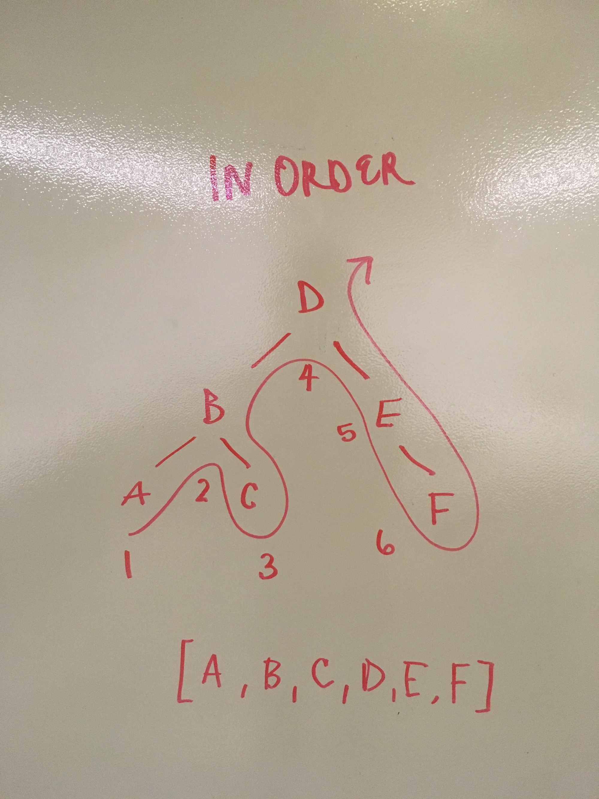
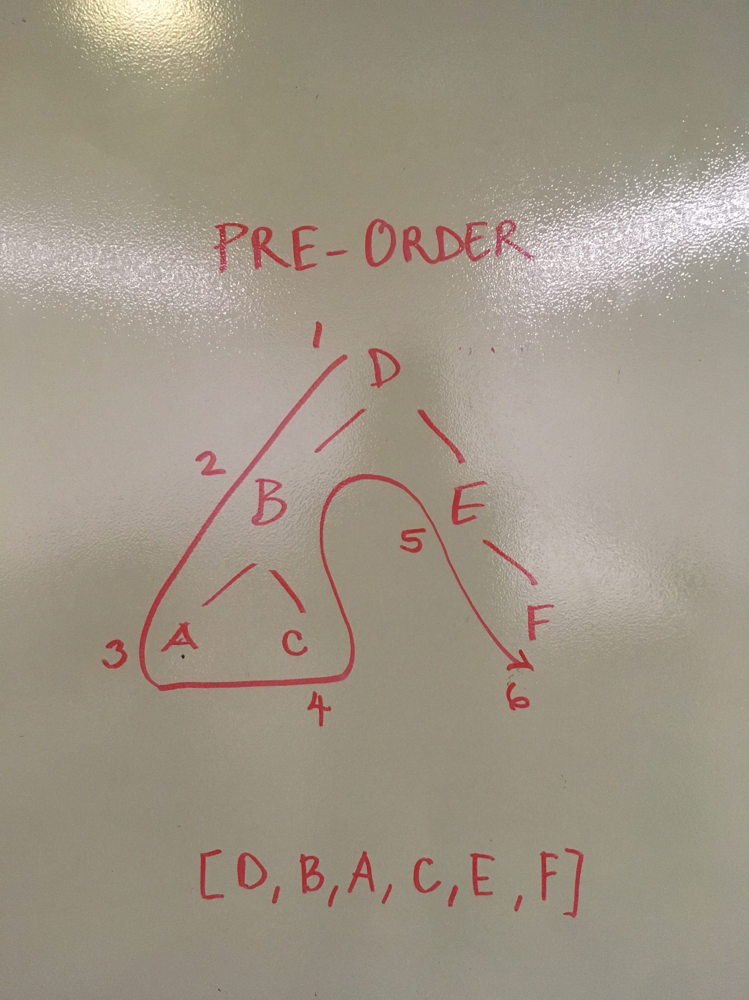
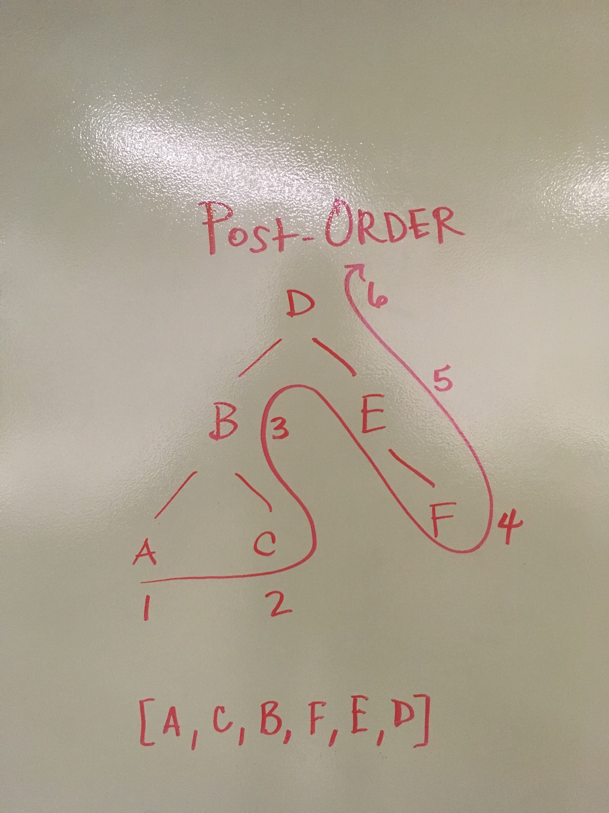
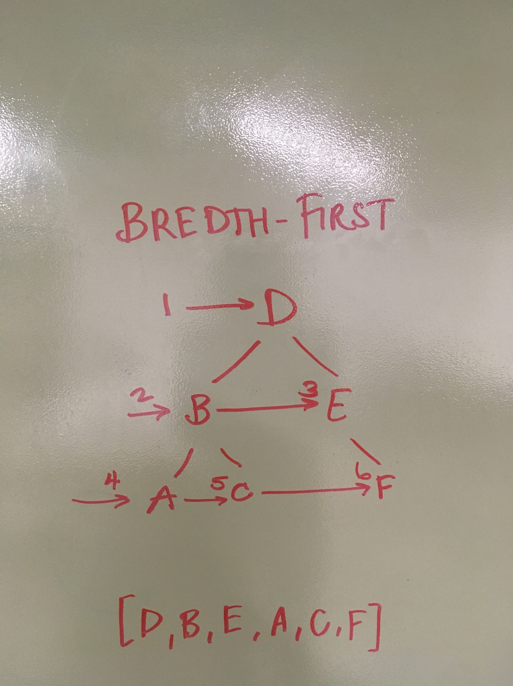
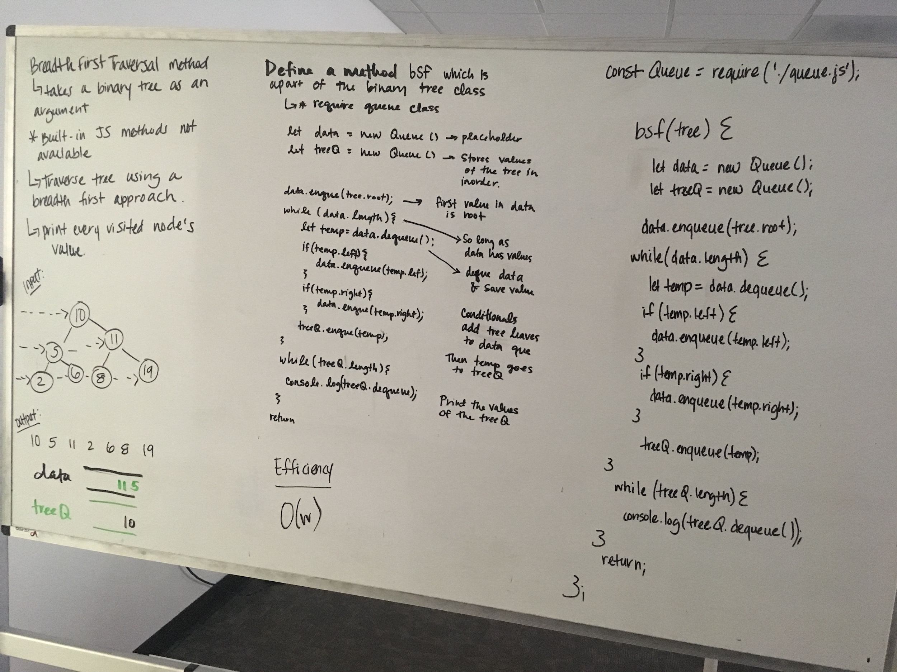

# Binary Tree Traversals

##Author
Caity Heath

#### Types of Traversals 
In this folder I have coded the following 4 types of binary tree traversals
##### Vertical Traversals 
* In-Order: Starts with the smallest node  in a sorted tree and returns an array of nodes from smallest to largest. 

* Pre-Order: Pushes the node into the array the last time it visits it on its left hand side. 

* Post-Order: Pushes the node into the array the first time it visits it on its left hand side

##### Horizontal Traversals
* Bredth-First: Enqueues the node onto a stack from top-bottom & left-right.

______________________________________________________

## Breadth-first
This is a Data-Structures and Algorithms code challenge supplied by Code Fellows. 

## Challenge
Write a breadth first traversal method which takes a Binary Tree as its unique input. Without utilizing any of the built-in methods available to your language, traverse the input tree using a Breadth-first approach; print every visited node’s value.

## Approach & Efficiency
The first step in my algorithm is to create 2 instances of the Queue class. One instance will act as a temporary data container, the other will hold the nodes in the order of the bredth-first traversal. tree.root will be enqueued onto the data queue. Then I open up a while loop which will iterate as long as data has a length. Inside the while loop we assign a temp variable the value of data.dequeue(). Then we will check if temp.left and right have  nodes if so, enqueue that node into data. Outside those conditionals treeQ.enqueue(data.dequeue). That last line will dequeue the values in data into the treeQ Queue in the order they we're visited on the tree. Then to finish the problem, we open another for loop which checks treeQ's length and console logs treeQ.dequeue(), thus the bredthFirst method prints each of the nodes on the input tree in the order they were visited by a bredthFirst traversal. 

## Solution
Whiteboard: 

