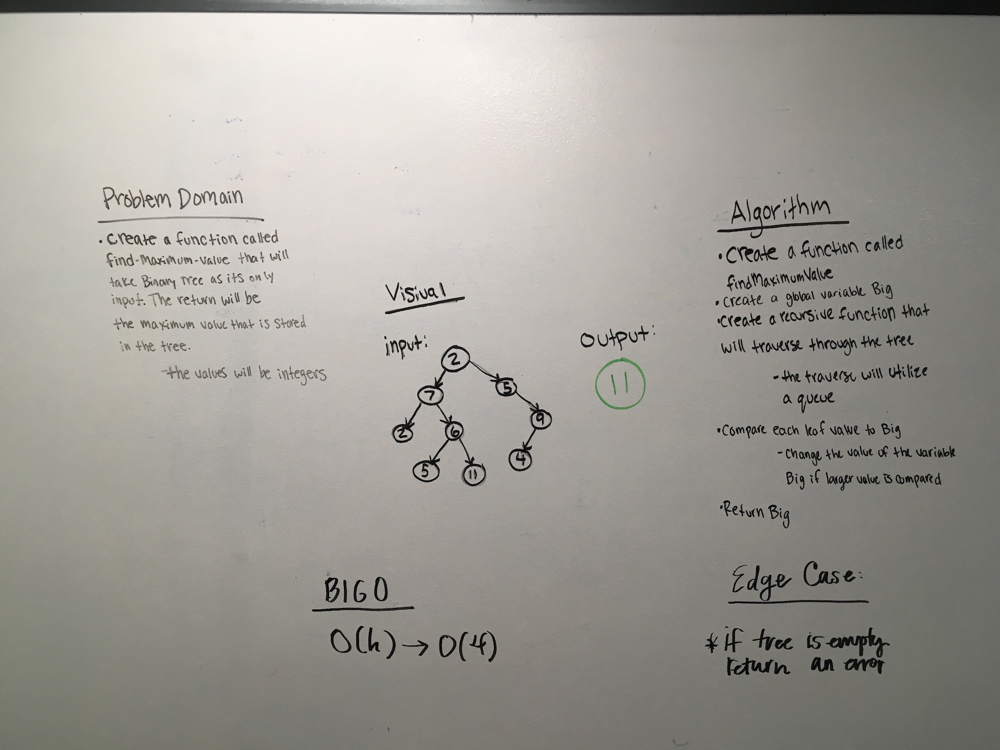
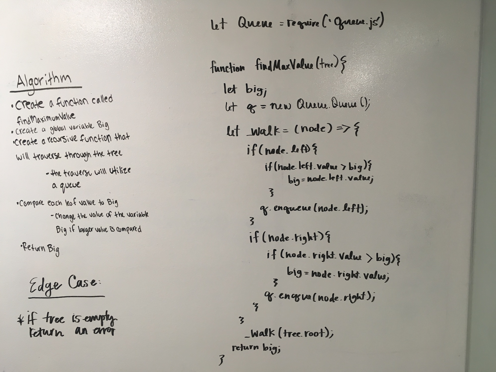

# Find the Maximum Value in a Binary Tree
<!-- Short summary or background information -->

## Authors
Caity Heath and Siobhan Niess

## Challenge
This is a Code Fellows 401 Data-Structures and Algorithms problem

Write a function called find-maximum-value which takes binary tree as its only input. Without utilizing any of the built-in methods available to your language, return the maximum value stored in the tree. You can assume that the values stored in the Binary Tree will be numeric.

## Approach & Efficiency
Our algorithm for this code challenge utilized a recursive function to traverse the tree depth-first. We start by determining if the tree.root is null if so return. This way the function immediately returns undefined if the tree is empty. Next we assigned a variable "big" to the value of the tree.root. 

Next we defined a recursive function called "_walk" inside it contains a two nested if statements. The first looks at the left child and determines if the value is greater than "big", if so "big" is reassigned the value of the left node. Then "_walk" is called. Rinse and repeat for the right child. When the function breaks the value of big is returned. 

The run-time efficiency for this solution is O(h) h = height of the tree. 

## Solution
Problem Domain, Visual and BigO

Algorithm and Code
