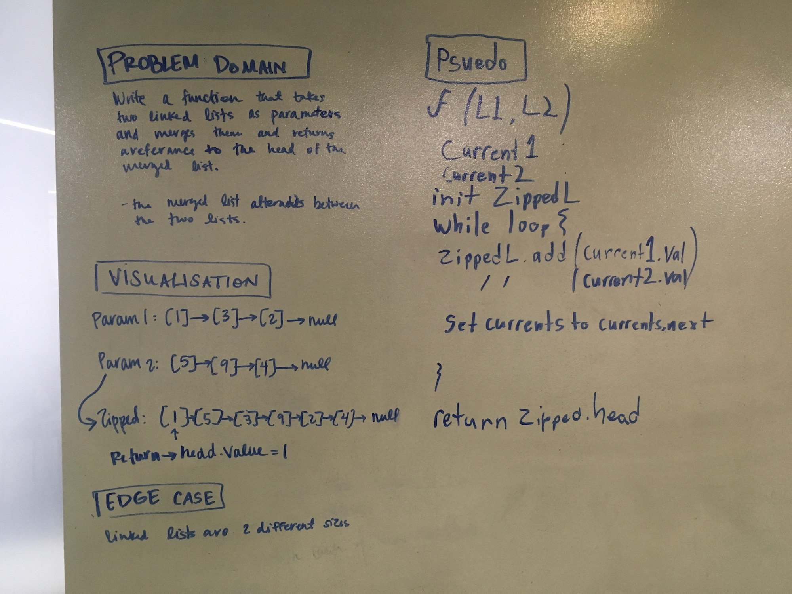
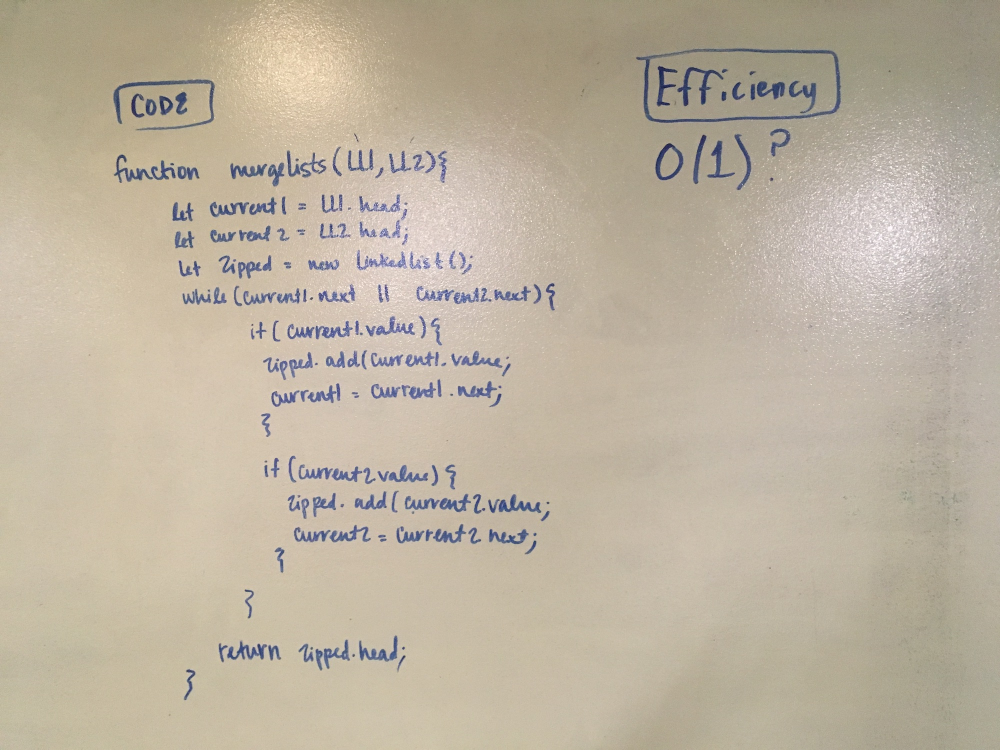

# Merge two Linked Lists

## Challenge
This application contains a function called mergeLists which takes two linked lists as arguments. Zips the two linked lists together into one so that the nodes alternate between the two lists and return a reference to the head of the zipped list.  This function has access to the Node class and all the properties on the Linked List class as well as the methods created in previous challenges. It utilize the append(val) method specifically.

## Approach & Efficiency
This function has an O(1) space efficiency and a o(n) time efficiency. It uses 1 while loop to iterate through the list and alternate appending the values of the nodes in the arguement lists to the zipped list. In the case of the lists being two different sizes, it will continue to append the values of the longest list after the end of the shorter list. 

## Solution

### Note About Testing
Because the function returns a reference to the head node of the zipped list, it is difficult to test my edge case of the arguement lists having different lengths. The test is testing just for the head reference however, there is a console log of the linked list that shows that it is appending correctly when the lists are different lengths 