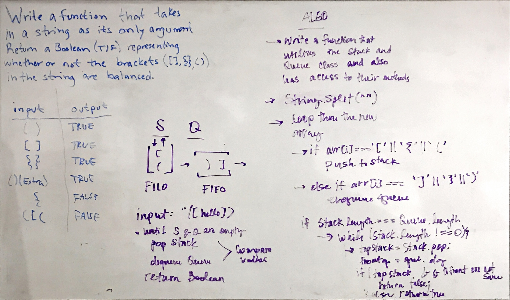
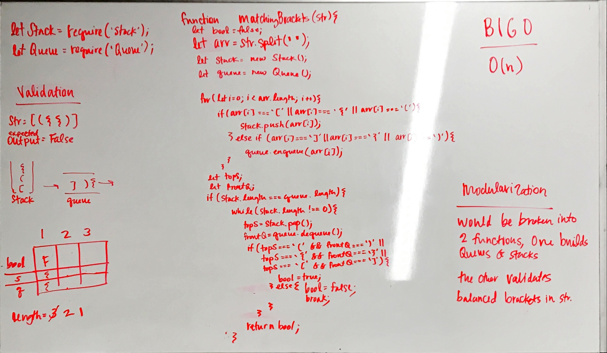

# Multi-Bracket Validation

## Authors
 John DiQuattro, Michael George and Caity Heath 

## Challenge
This challenge asks us to determine whether or not a string input has balanced bracketing.

```
Round Brackets : ()
Square Brackets : []
Curly Brackets : {}
Input                     Output
{}                         TRUE
{}(){}                     TRUE
()[[Extra Characters]]     TRUE
(){}[[]]                   TRUE
{}{Code}[Fellows](())      TRUE
[({}]                      FALSE
(](                        FALSE
{(})                       FALSE
Consider these small examples and why they fail.
Input       Output        Why
{           FALSE           error unmatched opening { remaining.
)           FALSE           error closing ) arrived without corresponding opening.
[}        FALSE         error closing }. Doesn’t match opening (.

```

## Approach & Efficiency

The efficiency of this problem as we solved it is O(n). This is because of the for loop that we use to iterate through the array which holds our deconstructed string. 

We could adhere to the SOLID principles by breaking the function into two functions. One would deconstruct the string and values into a stack and queue depending on if they are right or left facing. 
The other function would validate whether or not they are balanced. 

## Setup 
In order to run the tests on my application, you will need to `npm i` to install the node dependency packages. 

## Solution
Problem Domain and Algorithm


Code, BigO and Validation

