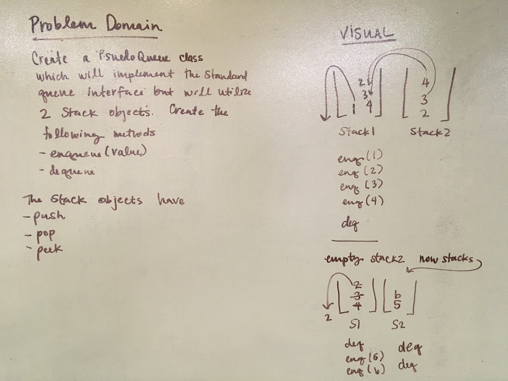
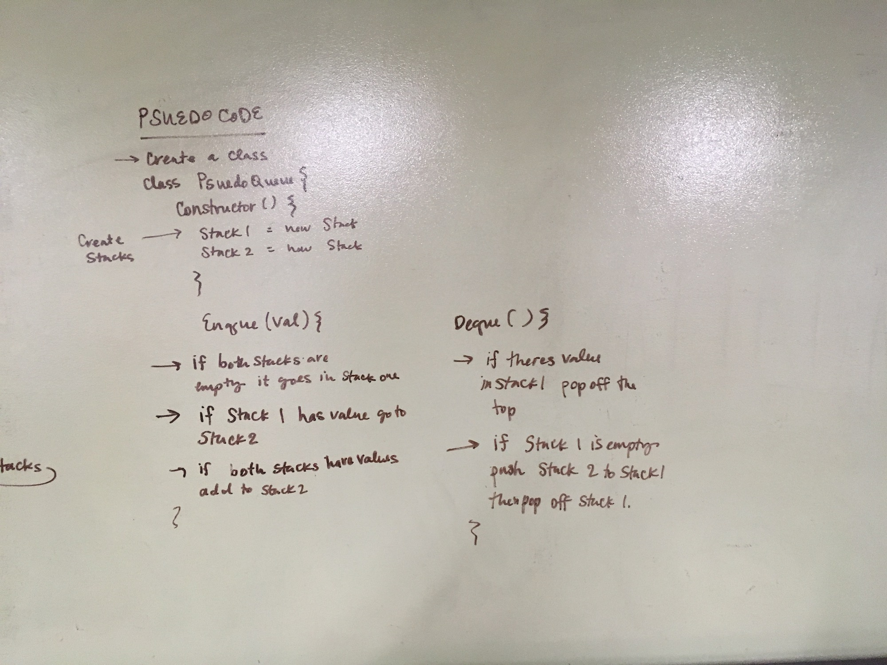

# Authors: Caity Heath & Jared 

## Challenge
create a PseudoQueue class. Do not use an existing Queue. Instead this PsuedoQueue class will implement the standard queue interface but ill internally only utilize 2 stack objects. Create your class with the following methods
* enqueue(value)
* dequeue()

## Approach and Efficiency 
The efficiency of this has a O(1) because we are using stacks to hold the values of the Queue. Each time a method is called on one values are replaced rather than creating new memory. 

Our approach was to put the first value enqueued into our first stack. Then when values are added they go in the other stack. If dequque is called on the Queue, the value in stack 1 is popped. When stack 1 is empty all of the values in stack 2 are popped into stack 1. Now the next value to be popped will pop off stack 1 and if values are enqueued they are added to stack 2. 

## Solution 

## Testing
Tests are still in the process of being written. 
